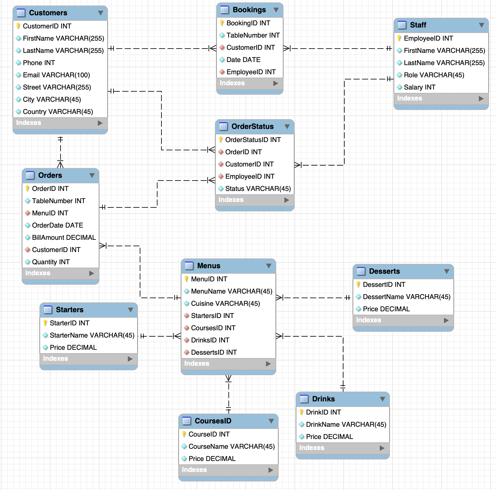

# Little Lemon DB
Meta Database Engineer Capstone Project.

# How to
## MySQL
In order to run and test this project you should:

- Create database named `Little-Lemon-DB` using Forward-Engineering method in MySQLWorkbench, or by running create_database.sql
- Run all other queries in queries folder to create Stored Procedures, Functions and to populate tables

## Running Python

In order to run main.ipynb properly you should edit database uder to one, that have access to your little_lemon_db database

## Quik link to analysis

[Tableau-Export.pdf](03-Analysis/Tableau-Export.pdf)

[Little-Lemon-Workbook.pptx](03-Analysis/Little-Lemon-Workbook.pptx)

---

Thank you for reviewing my project.
